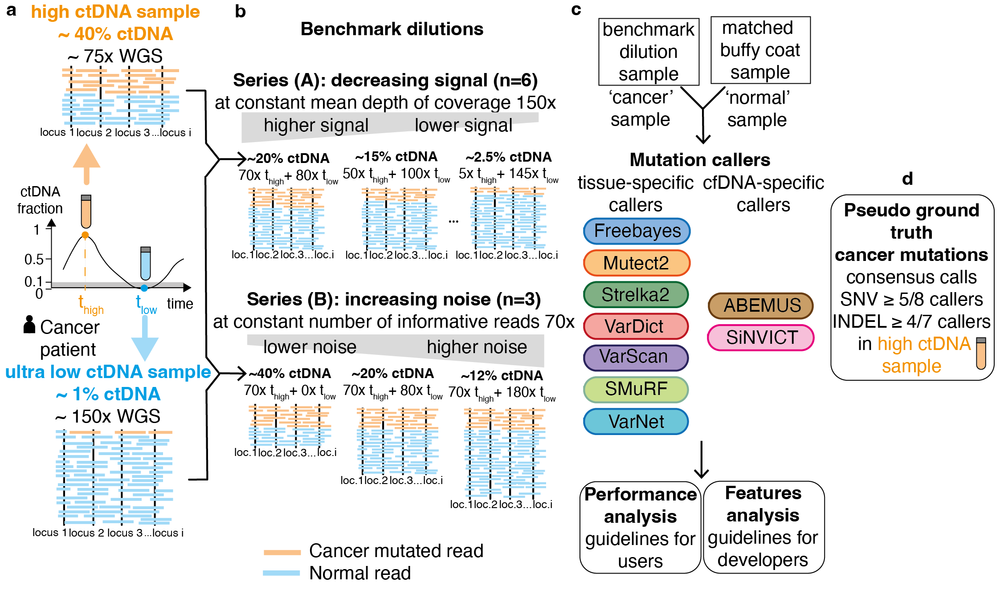

# cfdna_snv_benchmark

This repository contains the code and documentation for benchmarking SNV callers on cfDNA samples. The methods described here support the analyses presented in our manuscript submission.

## Table of Contents

 [Requirements](#requirements)

 [Installation](#installation)

 [Overview](#overview)

 [Usage](#usage)
  - [0. Environment Setup & Directory Structure](#0-environment-setup--directory-structure)
  - [1. Design Benchmark Dataset](#1-design-benchmark-dataset)
  - [2. Create Benchmark Dataset](#2-create-benchmark-dataset)
  - [3. Run Variant Callers](#3-run-variant-callers)

[Figures](#figures)

---

## Requirements

**Dependencies:**

- External tools and variant callers as detailed in Section [3. Run Variant Callers](#3-run-variant-callers)
- Additional software as specified in each caller’s installation notes (see `callers/[callername]/installation_notes.md`)

---

## Installation

1. **Clone the Repository:**

   ```sh
   git clone <your-repository-url>
   cd cfdna_snv_benchmark
   ```

2. **Set the Python Path:**

   Add the repository to your Python path:

   ```sh
   export PYTHONPATH=$PYTHONPATH:"/path/to/cfdna_snv_benchmark/"
   ```
---

## Overview

Figure 1 below illustrates the overall workflow of the benchmark study.



---

## Usage

### 0. Environment Setup & Directory Structure

Define the paths for the repository and data directories. Replace the example paths with those relevant to your system.

```sh
export repodir=/home/users/astar/gis/carriehc/cfdna_snv_benchmark
export datadir=/rfs-storageservice/GIS/Projects/LOCCG/carriehc/data
export extdatadir=/rfs-storageservice/GIS/Projects/LOCCG/carriehc/extdata
```

Create the necessary folder structure:

```sh
mkdir -p ${datadir}/{initialsamples,logs,mixtures,mixtures_ultradeep,mixtures_wholegenome,PoNbuffycoat,PoNbuffycoat_ultradeep}
ls ${datadir}
```

Expected output:
```
├── initialsamples
├── logs
├── mixtures
├── mixtures_ultradeep
├── mixtures_wholegenome
├── PoNbuffycoat
└── PoNbuffycoat_ultradeep
```

For external data:

```sh
mkdir -p ${extdatadir}/{dbsnp_vcf,exome_bed,GRCh37,wholegenome_bed}
ls ${extdatadir}
```

Expected output:
```
├── dbsnp_vcf
├── exome_bed
├── GRCh37
└── wholegenome_bed
```

---

### 1. Design Benchmark Dataset

The following steps outline how to design and generate the benchmark dataset (see Figure 2 and Table 1 in the manuscript).

#### 1.1. Identify Suitable Candidates for Deep WGS

From a cohort of longitudinal cfDNA samples (with lpWGS and deep targeted sequencing), screen for candidates based on:
- Tumor fraction (ichorCNA estimates)
- VAF of mutations from targeted sequencing

Run the following script:

```sh
mutationfolder=data/variant_calls/226\ PANEL\ VARIANTS\ CLASSIFICSATION\ EXCEL
listpatients=()
for f in ${mutationfolder}/*; do
    if [[ $(basename $f) == CCG* ]]; then
        patient=$(basename $f | awk -F'_' '{print $3}')
        echo $patient
        listpatients+=("$patient")
        python $repodir/initialsamples/patient_timeline_analysis.py --patient $patient
    fi
done
echo ${listpatients[@]}
```

Next, generate pileups for targeted samples:

```sh
export filename="${repodir}/initialsamples/candidate_samples_pileup_targeted.txt"
while IFS=$'\t' read -r bamfile bedfile outputfile refgenome condapath; do
    echo "$(basename $bamfile) $(basename $bedfile) $(basename $outputfile) $(basename $refgenome)"
    bash ${repodir}/initialsamples/pileup.sh $bamfile $bedfile $outputfile $refgenome $condapath
done < "$filename"
```

#### 1.2. Validate Deep WGS Samples

Generate pileups for deep WGS samples:

```sh
export filename="${repodir}/initialsamples/candidate_samples_pileup_deepWGS.txt"
while IFS=$'\t' read -r bamfile bedfile outputfile refgenome condapath; do
    echo "$(basename $bamfile) $(basename $bedfile) $(basename $outputfile) $(basename $refgenome)"
    bash ${repodir}/initialsamples/pileup.sh $bamfile $bedfile $outputfile $refgenome $condapath
done < "$filename"
```

Generate paired plots:

```sh
mutationfolder=data/variant_calls/226\ PANEL\ VARIANTS\ CLASSIFICSATION\ EXCEL
listpatients=()
for f in ${mutationfolder}/*; do
    if [[ $(basename $f) == CCG* ]]; then
        patient=$(basename $f | awk -F'_' '{print $3}')
        echo $patient
        listpatients+=("$patient")
        python $repodir/initialsamples/paireplots.py --patient $patient
    fi
done
```

#### 1.3. Design Mixtures Series

Generate the mixture design:

```sh
cd $repodir/initialsamples
python design_mixtures.py
```

---

### 2. Create Benchmark Dataset

For deep Whole Genome Sequencing (WGS), the samples are split by chromosome (due to storage/memory constraints). For deep Whole Exome Sequencing (WES), all chromosomes are processed together.

#### 2.1. Prepare Configuration Files

Copy the configuration template and adapt it for your mixture series:

```sh
cd ${repodir}/mixtures
cp config/config_template.yml config/config_mixtures_chr1_CRC-986_100215-CW-T_CRC-986_300316-CW-T.yml
vi config/config_mixtures_chr1_CRC-986_100215-CW-T_CRC-986_300316-CW-T.yml
```

Then, generate configurations for chromosomes 2–22:

```sh
cd ${repodir}/mixtures
bash create_config_yaml.sh config/config_mixtures_chr1_CRC-986_100215-CW-T_CRC-986_300316-CW-T.yml
```

#### 2.2. Run Mixture Series Creation on HPC (Slurm)

Submit a job for a WGS series on chromosome 1:

```sh
mkdir -p ${datadir}/data/logs
sbatch -p normal -J chr1_986_mixtures -t 24:00:00 --mem=48000 \
  --output=${datadir}/data/logs/chr1_986_mixture_wgs.o \
  --error=${datadir}/data/logs/chr1_986_mixtures_wgs.e \
  ${repodir}/mixtures/create_mixtures_series_chr.sh \
  -c ${repodir}/mixtures/config/config_mixtures_chr1_CRC-986_100215-CW-T_CRC-986_300316-CW-T.yml
```

#### 2.3. Alternatively, Download the Benchmark Dataset from S3

1. Configure your AWS CLI (update `~/.aws/credentials` with a READ-ONLY access key).
2. List the dataset contents:

   ```sh
   aws s3 ls s3://cfdna-benchmark-dataset.store.genome.sg/mixtures/mixtures_chr1/mixtures_chr1_CRC-986_100215-CW-T_CRC-986_300316-CW-T/ --profile [your-profile]
   ```

3. To inspect a specific mixture sample folder:

   ```sh
   aws s3 ls s3://cfdna-benchmark-dataset.store.genome.sg/mixtures/mixtures_chr1/mixtures_chr1_CRC-986_100215-CW-T_CRC-986_300316-CW-T/mixture_chr1_CRC-986_100215-CW-T_70x_CRC-986_300316-CW-T_80x/ --profile [your-profile]
   ```

---

### 3. Run Variant Callers

#### 3.1 Install Variant Callers

Please install each caller as per the provided guidelines. See `callers/installation_notes.md` for more details.

#### 3.2. Prepare Caller Configuration Files

For each caller (replace `${caller}` with the caller name):

```sh
cd ${repodir}/callers/${caller}
cp config/config_template.yml config/config_${caller}_mixtures_chr1_CRC-986_100215-CW-T_CRC-986_300316-CW-T.yml
vi config/config_${caller}_mixtures_chr1_CRC-986_100215-CW-T_CRC-986_300316-CW-T.yml
```

Then, generate configuration files for chromosomes 2–22:

```sh
bash create_config_yaml.sh config/config_${caller}_mixtures_chr1_CRC-986_100215-CW-T_CRC-986_300316-CW-T.yml
```

#### 3.3. Run DNA-Specific Callers via bcbio Pipeline

For **Freebayes, Mutect2, Strelka2, Vardict, Varscan**:

1. Prepare the bcbio input file:

   ```sh
   bash ${repodir}/callers/bcbio/prepare_bcbio.sh -c ${repodir}/callers/bcbio/config/config_bcbio_template.yml
   ```

2. Run the pipeline:

   ```sh
   bash ${repodir}/callers/bcbio/run_bcbio.sh -c ${repodir}/callers/bcbio/config/config_bcbio_template.yml
   ```

3. Monitor and manage jobs:

   ```sh
   python ${repodir}/callers/bcbio/monitor.run.status.py -d ${bcbiodir}
   bash ${repodir}/callers/bcbio/delete.finished.sh -c ${repodir}/callers/bcbio/config/config_bcbio_template.yml
   ```

For **SMuRF**, follow analogous steps using the `prepare_smurf.sh` and `run_smurf.sh` scripts.

For **VarNet**, submit a job (adjust parameters as needed):

```sh
export chr='1'
sbatch -p normal -J varnet_${chr}_${mixtureid} -t 3-00:00:00 -N 1 --mem=128000 \
  --output=${datadir}/logs/varnet_${mixtureid}_${chr}_${mode}.o \
  --error=${datadir}/logs/varnet_${mixtureid}_${chr}_${mode}.e \
  ${repodir}/callers/varnet/run_varnet.sh -c ${repodir}/callers/varnet/config/config_varnet_mixtures_chr${chr}_${mixtureid}.yml
```

> **Note:** Parameters (e.g., partition, time, memory) should be adjusted based on whether the data is WES or WGS.

#### 3.4. Run cfDNA-Specific Callers

**ABEMUS:**

1. Prepare the dbSNP database:

   ```sh
   sbatch -p normal -J prepare_dbSNP -t 24:00:00 --mem=48000 \
     --output=${datadir}/data/logs/prepare_dbSNP.o \
     --error=${datadir}/data/logs/prepare_dbSNP.e \
     ${repodir}/callers/ABEMUS/prepare_dbSNP.sh $extdatadir $repodir
   ```

2. Prepare the Panel of Normals (PoN):

   ```sh
   sbatch -p normal -J prepare_PoN -t 24:00:00 --mem=48000 \
     --output=${datadir}/data/logs/prepare_PoN.o \
     --error=${datadir}/data/logs/prepare_PoN.e \
     ${repodir}/callers/ABEMUS/prepare_PoN.sh $buffycoatbam $patientid $datadir $extdatadir $condapath $mode
   ```

3. Run ABEMUS:

   ```sh
   export chr='1'
   sbatch -p normal -J abemus_${chr}_${mixtureid} -t 1-00:00:00 -N 1 --mem=64000 \
     --output=${datadir}/logs/abemus_${mixtureid}_${chr}_${mode}.o \
     --error=${datadir}/logs/abemus_${mixtureid}_${chr}_${mode}.e \
     ${repodir}/callers/ABEMUS/run_abemus.sh -c ${repodir}/callers/ABEMUS/config/config_abemus_mixtures_chr${chr}_${mixtureid}.yml
   ```

**SiNVICT:**

```sh
export chr='1'
sbatch -p normal -J sinvict_${chr}_${mixtureid} -t 3-00:00:00 -N 1 --mem=64000 \
  --output=${datadir}/logs/sinvict_${mixtureid}_${chr}_${mode}.o \
  --error=${datadir}/logs/sinvict_${mixtureid}_${chr}_${mode}.e \
  ${repodir}/callers/sinvict/run_sinvict.sh -c ${repodir}/callers/sinvict/config/config_sinvict_mixtures_chr${chr}_${mixtureid}.yml
```

#### 3.5. Alternatively, Download Caller Outputs from S3

Caller outputs are stored in subfolders. To list the outputs for a given mixture:

```sh
aws s3 ls s3://cfdna-benchmark-dataset.store.genome.sg/mixtures/mixtures_chr1/mixtures_chr1_CRC-986_100215-CW-T_CRC-986_300316-CW-T/mixture_chr1_CRC-986_100215-CW-T_70x_CRC-986_300316-CW-T_80x/calls/ --profile [your-profile]
```
---

## Figures

- **Figure 1:** Overview of the benchmark workflow (see above)
- **Figure 2:** Design of the benchmark dataset.  
  *See Jupyter Notebook:* `plots/Figure2-annonym.ipynb`
- **Figure 3:** Performance at intermediate sequencing depth (150x).  
  *See Jupyter Notebook:* `plots/Figure3-4.ipynb`
- **Figure 4:** Performance at high sequencing depth (2000x).  
  *See Jupyter Notebook:* `plots/Figure3-4.ipynb`
- **Figure 5:** Feature analysis.  
  *To reproduce, run:*

  ```sh
  cd $repodir/plots
  python figure5.py
  ```
